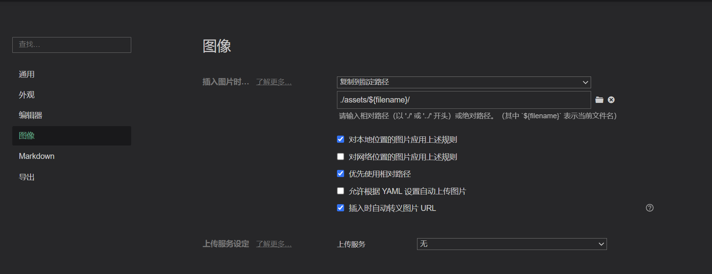

# Lite-Blog-Doc

**这是博客系统的文档仓库，记录的关于这个系统的各种各样的文档**

------

# 1.要求

- 所有的文档都用md格式书写，建议使用软件typora
- 图片路径均使用相对路径 `./assets/${filename}/`
- 文档分类明确，比如需求文档放一个类，就建一个文件夹requirement，里面就存放相关文件
- 小分类比如system下可能会有web，mq等等分类
- 合理使用md功能，设计到代码必须用代码块，内容分层级，目录结构

## 2.目前结构

注:`根目录如有变动，须修改此处`

```txt
|
|--assests      -- 图片等静态文件存放
|
|--build        -- 部署文档，记录部署的方法与过程
|
|--dev          -- 开发文档，主要记录开发遇到的问题
|
|--ui           -- 与前端有关的文档，介绍以及技术文档
|
|--system       -- 与后端有关的文档，介绍以及接口等技术文档
|
|--database     -- 数据库文档，数据库设计等等
|
|--requirements -- 系统的需求文档，记录需求 
```

## 3.Typora使用

在`偏好设置`中的`图像`配置项中如下图:


