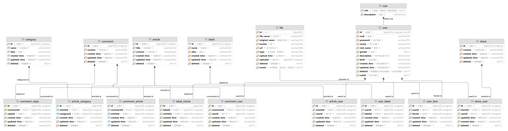
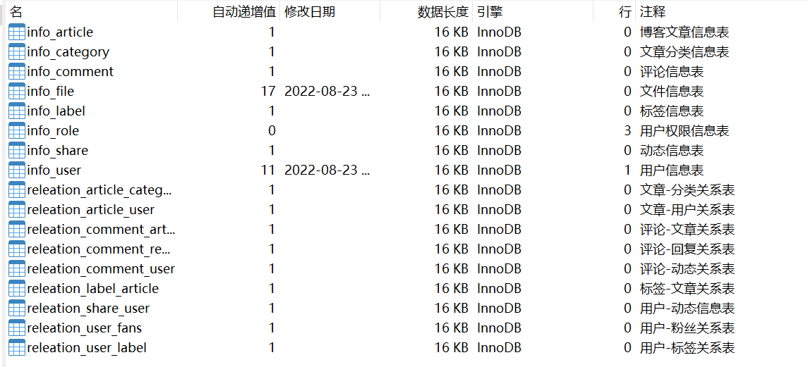

# Lite-Blog-DataBase

这是博客的数据库文档，记录了数据库设计与开发的相关文档。

------

## 概览

截止2022/8/23，数据库结构如下

## 注意事项

1. 新建一个表时，需要对表以及表的所有字段书写足够语义化的注释
2. 每一个表都要有一个主键id，必须是BIGINT类型，长度20
3. 表大致分两种类型，一个是信息表，一个是关系表。信息表必须加上info前缀，关系表必须加上releation前缀
4. 在进行数据库设计与开发时时刻需要注意外键引用的问题
5. 所有的外键策略都应该是RESTRICT
6. 所有的表都必须要有 created_time -- 创建时间,updated_time -- 更新时间,deleted -- 逻辑删除 这三个基础字段